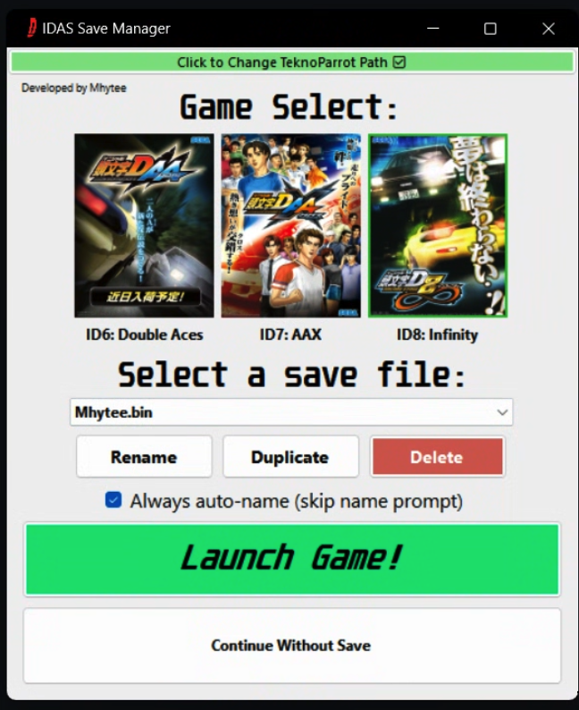

INITIAL D ARCADE STAGE SAVE MANAGER  
===================================  

Launch Games & Manage Multiple Save Files for Initial D Arcade Stage 6-8 (TeknoParrot)

> I originally made this program so that it would be easy for my girlfriend and/or guests to play on their own saves and for us to be able to switch back and forth easily...  
> Turns out she doesn't really enjoy playing and I have no friends, so here it is, for anyone else who might find it useful.

REQUIREMENTS  
---------------  
- 64-bit Windows 10 or 11 (nothing else to install; the app is fully self-contained)  
- A working TeknoParrot setup with Initial D Arcade Stage 6, 7, or 8

INSTALLATION  
---------------  
1. Download the latest `.zip` release from the [Releases](https://github.com/mhytee/idas_save_manager/releases) tab.  
2. Extract the zip anywhere you like (e.g., Desktop or Documents).  
3. Run the program by double-clicking `IDAS_Save_Manager.exe`.  
4. On first launch, click the large red button at the top to set your `TeknoParrotUi.exe` path. _(This is required before launching any games.)_

**Note:** Windows SmartScreen may show a warning the first time you run the app, since it isn't code-signed. Click "More info", then "Run anyway".

WHAT THIS TOOL DOES  
----------------------  
TeknoParrot only has one active save slot per game, so everyone who plays ends up sharing (and overwriting) the same profile. This tool fixes that: it stores as many save files as you want and loads any of them in a couple of clicks. Pick a game, pick a save, hit Launch Game, and play. Perfect for letting friends and family play on their own saves, or for keeping a separate practice profile.

Supports Initial D Arcade Stage 6, 7, and 8 (TeknoParrot versions).

Features:  
- **Automatically backs up** save files from `AppData\TeknoParrot\`
- **Restore and launch** any save directly, no need to open TeknoParrot manually
- **Launch without a save**, ideal for creating new profiles
- **Rename**, **Duplicate**, and **Delete** saves
- **Reads your in-game player name** and uses it as the save name (when possible)
- Optional **toggle to skip save name prompts** and auto-name silently
- **Remembers your last selected game and save** between launches
- **Keeps itself up to date**: checks GitHub at startup (silently, never blocking); when a new version exists, a gold "Update available" button appears and one click installs it. Your saves and settings are never touched by an update.

SAVE FILES LOCATION  
----------------------  
All backups are stored at:  
`AppData\IDAS_Save_Manager\IDAS_Backups`

PROGRAM BEHAVIOR  
-------------------  
- On first launch, the program will detect your existing save files and prompt you to import them.

- If you launch a game without a save, the app will monitor for new save files.  
  - When TeknoParrot exits, you'll be prompted to name and store the new save (or it will auto-name if the prompt is skipped).  

- If a save is already in TeknoParrot's AppData folder at launch, it is treated as external and will be imported.

- The app always moves save files from TeknoParrot's folder after each session to prevent accidental overwrites.

UNINSTALLING  
---------------  
To fully remove the app:  
1. Delete the EXE and extracted folder.  
2. (Optional) Delete your settings and backups at:  
   `AppData\IDAS_Save_Manager`

**Note:** Be sure to back up any important saves from `IDAS_Backups` before uninstalling!

BUGS & FEEDBACK  
---------------  
Found a bug or have a suggestion? Open an issue on the [Issues](https://github.com/mhytee/idas_save_manager/issues) tab.

---

Developed by Mhytee, a lonely driver.
